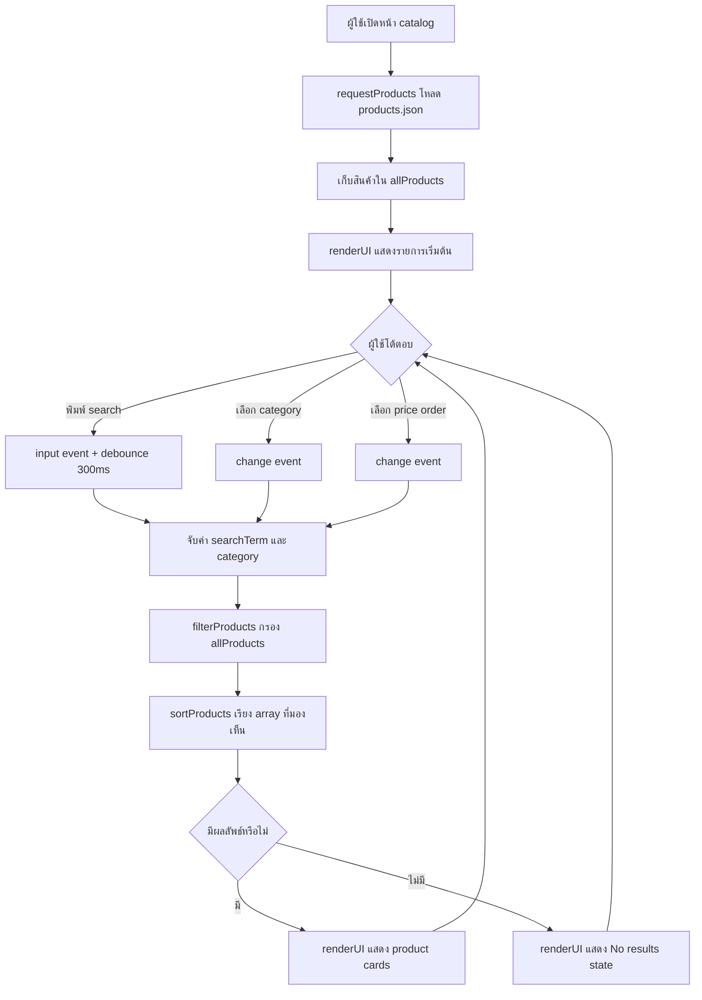

# Session 03: Interactive UI With JavaScript

ไฟล์นี้เป็น artifact ประกอบกิจกรรมจาก `03_Interactive UI with JS.pdf` สำหรับการค้นหาสินค้า การเลือกหมวดหมู่ และการเรียงราคา

## Activity Diagram

## Logic Table

| User Action | DOM Event | Business Logic | UI Result |
| --- | --- | --- | --- |
| พิมพ์ `gura` หรือ `GURA` | `input` หลัง debounce | `filterProducts()` เปรียบเทียบ `product.name` แบบ lower case | แสดง Gura Shark Plushie |
| เลือก `Mugs` | `change` | กรอง `product.category === 'Mugs'` | แสดงเฉพาะแก้วมัค |
| เลือก `All` | `change` | ไม่จำกัด category | แสดงรายการที่ตรง search ทุกหมวด |
| เลือก `ราคา: สูงไปต่ำ` | `change` | `sortProducts()` เรียง `price` จากมากไปน้อย | cards เปลี่ยนลำดับทันที |
| พิมพ์ `@` หรือชื่อที่ไม่มี | `input` หลัง debounce | `.includes()` คืนผลลัพธ์ว่างโดยไม่ throw error | แสดงข้อความไม่พบสินค้า |

## Mapping To Implementation

| Requirement | Implementation |
| --- | --- |
| Source of truth เป็น array | `allProducts` ใน `app.js` |
| Search bar และ category dropdown | `#search-input`, `#category-filter` ใน `index.html` |
| Case-insensitive product-name filter | `filterProducts(searchTerm, category)` |
| Re-render DOM หลัง state เปลี่ยน | `renderFilteredProducts()` เรียก `renderUI()` |
| Sorting example จาก logic table | `#sort-filter` และ `sortProducts()` |
| Debouncing | `debounce(renderFilteredProducts, 300)` |
| No-result edge case | empty state ภายใน `renderUI()` |
